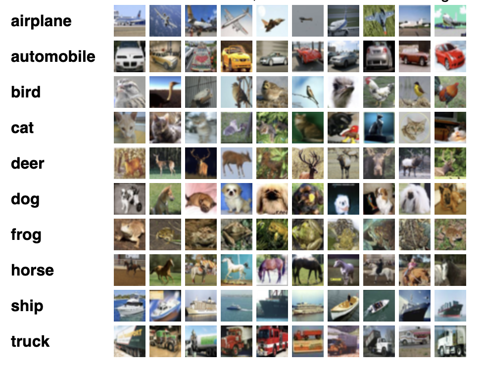

# CIFAR CNN на чистом C

Этот проект демонстрирует реализацию сверточной нейронной сети (CNN) на языке C для обучения на наборе данных CIFAR-10. Реализация включает:
- Два сверточных слоя с валидной свёрткой
- Активацию ReLU после каждого сверточного слоя
- Max pooling
- Полносвязный (fully-connected, FC) слой
- Функцию softmax с кросс-энтропийной потерей
- Адаптивную скорость обучения
- Механизм ранней остановки
- Сохранение лучших весов модели
- Визуализацию результатов предсказаний

Реализация содержит прямой (forward) и обратный (backpropagation) проходы, а также обновление параметров с использованием стохастического градиентного спуска (SGD) с адаптивной скоростью обучения.

---

## Содержание

- [Обзор проекта](#обзор-проекта)
- [Структура проекта](#структура-проекта)
- [Сборка и запуск](#сборка-и-запуск)
- [Архитектура модели](#архитектура-модели)
- [Математическое описание слоёв](#математическое-описание-слоёв)
  - [Сверточные слои](#сверточные-слои)
  - [ReLU](#relu)
  - [Max Pooling](#max-pooling)
  - [Полносвязный слой](#полносвязный-слой)
  - [Softmax и кросс-энтропийная потеря](#softmax-и-кросс-энтропийная-потеря)
- [Тренировка сети](#тренировка-сети)
- [Инференс](#инференс)
- [Планы и улучшения](#планы-и-улучшения)

---

## Обзор проекта

Проект реализует улучшенную сверточную нейронную сеть, способную обрабатывать цветные изображения размером 32×32 (CIFAR) и классифицировать их по 10 классам. Основные возможности:
- Обучение на наборе данных CIFAR-10 с оптимизированной нормализацией
- Адаптивная скорость обучения с механизмом ранней остановки
- Сохранение весов при достижении лучшей точности на валидации
- Инференс с визуализацией результатов
- Оценка точности на тестовом наборе

## Датасет CIFAR-10

Набор данных CIFAR-10 состоит из 60000 цветных изображений размером 32x32 пикселя, разделенных на 10 классов по 6000 изображений в каждом. Датасет включает 50000 тренировочных и 10000 тестовых изображений.

Данные разделены на пять тренировочных пакетов и один тестовый, каждый по 10000 изображений. Тестовый пакет содержит ровно по 1000 случайно выбранных изображений из каждого класса. Тренировочные пакеты содержат оставшиеся изображения в случайном порядке, при этом некоторые пакеты могут содержать больше изображений одного класса, чем другого. В сумме тренировочные пакеты содержат ровно по 5000 изображений каждого класса.

Классы в датасете полностью взаимоисключающие. Например, нет пересечения между классами "automobile" (автомобиль) и "truck" (грузовик). Класс "automobile" включает седаны, внедорожники и подобные транспортные средства. Класс "truck" включает только большие грузовики. Ни один из этих классов не включает пикапы.

Вот классы датасета и 10 случайных изображений для каждого класса:



---

## Структура проекта

### Организация файлов
```
cifar_cnn/
├── include/                # Заголовочные файлы 
│   ├── stb_image_write.h  # Библиотека для работы с изображениями 
│   ├── utils.h            # Утилиты для весов и предсказаний 
│   ├── dataset.h          # Структуры для работы с данными 
│   ├── conv_layer.h       # Определения сверточного слоя 
│   ├── fc_layer.h         # Определения полносвязного слоя 
│   ├── maxpool_layer.h    # Определения слоя пулинга 
│   ├── softmax.h          # Определения softmax 
│   └── activations.h      # Определения функций активации 
├── src/                   # Исходный код 
│   ├── train.c           # Программа обучения 
│   ├── predict.c         # Программа инференса 
│   ├── utils.c           # Вспомогательные функции 
│   ├── conv_layer.c      # Реализация сверточного слоя 
│   ├── dataset.c         # Работа с данными 
│   ├── maxpool_layer.c   # Реализация пулинга 
│   ├── fc_layer.c        # Реализация полносвязного слоя 
│   ├── softmax.c         # Реализация softmax 
│   └── activations.c     # Реализация ReLU 
├── weights/               # Сохраненные веса модели
├── predictions/           # Результаты предсказаний
└── Makefile              # Скрипт сборки
```

### Анализ компонентов

1. **Ядро нейросети** (7.5KB):
   - `conv_layer.c/h`: Самый сложный компонент сети, реализующий свертку (3.3KB)
   - `maxpool_layer.c/h`: Реализация пулинга с отслеживанием индексов (1.9KB)
   - `fc_layer.c/h`: Компактная реализация полносвязного слоя (916B)
   - `activations.c/h`: Минималистичная реализация ReLU (355B)
   - `softmax.c/h`: Эффективная реализация softmax (764B)

2. **Основные программы** (12.5KB):
   - `train.c`: Самый большой файл проекта, содержащий:
     * Инициализацию всех слоев
     * Цикл обучения
     * Управление весами
     * Вычисление метрик
   - `predict.c`: Второй по размеру файл, включающий:
     * Загрузку весов
     * Процесс инференса
     * Визуализацию результатов

3. **Вспомогательные компоненты** (9.7KB):
   - `utils.c/h`: Третий по размеру компонент, содержащий:
     * Функции сохранения/загрузки весов
     * Обновление параметров (SGD)
     * Сохранение результатов в PNG
   - `dataset.c/h`: Работа с CIFAR-10 данными
   - `stb_image_write.h`: Внешняя библиотека для работы с изображениями

### Особенности реализации

1. **Модульность**:
   - Каждый компонент имеет четкое разделение на интерфейс (.h) и реализацию (.c)
   - Размеры заголовочных файлов минимальны (183B - 802B)
   - Основная логика сосредоточена в .c файлах

2. **Распределение кода**:
   - 43% кода в основных программах (train.c, predict.c)
   - 34% в вспомогательных функциях (utils.c, dataset.c)
   - 23% в реализации слоев нейросети

3. **Оптимизация**:
   - Компактные реализации базовых операций (activations.c, softmax.c)
   - Сложная логика вынесена в отдельные большие модули (conv_layer.c)
   - Эффективное переиспользование кода между train и predict

4. **Расширяемость**:
   - Модульная структура позволяет легко добавлять новые слои
   - Четкое разделение между обучением и инференсом
   - Возможность добавления новых форматов данных и визуализаций

---

## Сборка и запуск

### Требования

- Компилятор gcc
- Make
- Набор данных CIFAR-10 в директории cifar-10-batches-bin/

### Сборка

```bash
make
```

Это создаст два исполняемых файла:
- `bin/train` - для обучения модели
- `bin/predict` - для инференса

### Запуск

1. Обучение модели:
```bash
./bin/train
```
При обучении:
- Загружается тренировочный набор CIFAR-10
- Выполняется обучение в течение заданного числа эпох
- После каждой эпохи сохраняются веса в директорию weights/
- Выводится значение функции потерь и точность

2. Инференс:
```bash
./bin/predict [num_images]
```
где `num_images` - опциональный параметр, указывающий количество изображений для предсказания (по умолчанию 10).

При инференсе:
- Загружаются сохраненные веса из директории weights/
- Для каждого изображения:
  - Создается PNG файл с изображением
  - Создается текстовый файл с информацией о предсказании
  - Выводится предсказанный и истинный класс
- В конце выводится общая точность на тестовых изображениях

## Архитектура модели

Модель состоит из следующих слоёв:
1. Первый сверточный слой (ConvLayer1):
   - На вход подается изображение размером 32×32×3
   - Сверточный слой с ядром 3×3 и 32 фильтрами
   - Генерирует карту признаков размером 30×30×32
   - Инициализация весов методом Xavier

2. ReLU1:
   - Функция активации после первого сверточного слоя

3. Второй сверточный слой (ConvLayer2):
   - Принимает выход первого слоя 30×30×32
   - Сверточный слой с ядром 3×3 и 64 фильтрами
   - Генерирует карту признаков размером 28×28×64
   - Инициализация весов методом Xavier

4. ReLU2:
   - Функция активации после второго сверточного слоя

5. Max Pooling (MaxPoolLayer):
   - Сжимает карту признаков, используя окно 2×2
   - Приводит к выходу размером 14×14×64

6. Полносвязный слой (FCLayer):
   - Преобразует вектор признаков в выходной вектор с 10 элементами
   - Размер входа: 14×14×64 = 12544
   - Размер выхода: 10 (по числу классов)

7. Softmax и кросс-энтропийная потеря:
   - Преобразует выход в вероятностное распределение
   - Вычисляет функцию потерь

## Математическое описание слоёв

### Сверточные слои

Прямой проход:
Пусть $( x )$ – входной тензор размером $((C_{in}, H_{in}, W_{in}))$, $( w )$ – ядра свёртки размером $((C_{out}, C_{in}, K, K))$, а $( b )$ – смещения (biases) для каждого фильтра. Выходной тензор $( y )$ имеет размеры:
- $( H_{out} = H_{in} - K + 1 )$
- $( W_{out} = W_{in} - K + 1 )$

Формула свёртки для выходного элемента:

$$ y_{oc}(i, j) = b_{oc} + \sum_{ic=0}^{C_{in}-1} \sum_{m=0}^{K-1} \sum_{n=0}^{K-1} x_{ic}(i+m, j+n) \cdot w_{oc, ic, m, n} $$

где:

- $( oc )$ – индекс выходного канала,
- $( ic )$ – индекс входного канала,
- $( i, j )$ – координаты на выходной карте признаков.

Обратное распространение:
Градиенты вычисляются по весам, смещениям и входным данным с использованием цепного правила. Например, градиент по весу $( w_{oc,ic,m,n} )$ определяется как:
$$ \frac{\partial L}{\partial w_{oc, ic, m, n}} = \sum_{i,j} x_{ic}(i+m, j+n) \cdot \frac{\partial L}{\partial y_{oc}(i, j)} $$

Аналогичным образом вычисляются градиенты по входу и смещениям.

### ReLU

Функция активации ReLU применяется поэлементно:
$$ f(x) = \max(0, x) $$
Её производная:
    $$ f'(x) = \begin{cases} 1, & \text{если } x > 0 \ 0, & \text{иначе} \end{cases} $$
Это означает, что при обратном проходе градиент передаётся только через те нейроны, где $( x > 0 )$.

### Max Pooling

Max pooling применяется для уменьшения размерности карты признаков. Для каждого канала и для каждого окна размером $( p \times p )$ (в нашем случае $(2 \times 2)$ ) вычисляется:

$$ y_{c}(i, j) = \max { x_{c}(p, q) \mid p \in [i \cdot p, i \cdot p + p - 1],; q \in [j \cdot p, j \cdot p + p - 1] } $$   
При обратном распространении градиент передаётся только тому элементу, который дал максимум в каждом окне.  

При обратном распространении градиент передаётся только тому элементу, который дал максимум в каждом окне.

### Полносвязный слой

Полносвязный слой принимает на вход вектор $( x )$ (flattened из предыдущего слоя) и вычисляет:
$$ y = W x + b $$   
где:

- $( W )$ – матрица весов размером $((N_{\text{out}}, N_{\text{in}}))$
- $( b )$ – вектор смещений размером $( N_{\text{out}} )$.

Каждый элемент выходного вектора:
$$ y_i = b_i + \sum_{j=1}^{N_{\text{in}}} W_{ij} x_j $$

Обратное распространение вычисляет градиенты по весам и смещениям:
$$ \frac{\partial L}{\partial W_{ij}} = \frac{\partial L}{\partial y_i} \cdot x_j,\quad \   frac{\partial L}{\partial b_i} = \frac{\partial L}{\partial y_i} $$

### Softmax и кросс-энтропийная потеря

Softmax:
Для вектора входов $( z )$ softmax вычисляется по формуле:
$$ \sigma(z)i = \frac{e^{z_i}}{\sum{j=1}^{N} e^{z_j}} $$
где $( N )$ – число классов.

Кросс-энтропийная потеря:
При наличии истинной метки $( t )$ функция потерь вычисляется как:
$$ L = -\ln \big(\sigma(z)t\big) $$
Обратное распространение для softmax с кросс-энтропией дает градиент:
$$ \frac{\partial L}{\partial z_i} = \sigma(z)i - \mathbb{1}{{i = t}} $$
где $( \mathbb{1}{{i = t}} )$ – индикатор истинной метки (равен 1, если $( i = t )$ , иначе 0).

## Тренировка сети

Процесс обучения происходит по следующему алгоритму:

1. Нормализация данных:
   - Вычисление среднего и стандартного отклонения
   - Нормализация всего датасета

2. Прямой проход:
   - Последовательное применение слоев:
     * Conv1 -> ReLU1 -> Conv2 -> ReLU2 -> MaxPool -> FC -> Softmax
   - Вычисление кросс-энтропийной потери

3. Обратный проход (Backpropagation):
   - Вычисление градиентов от выхода к входу
   - Обновление весов всех слоев

4. Валидация и адаптация:
   - Проверка точности на валидационном наборе
   - Сохранение весов при улучшении точности
   - Уменьшение скорости обучения при отсутствии улучшений
   - Возможная ранняя остановка

## Инференс

Инференс с визуализацией результатов предсказаний.

## Планы и улучшения

Планируемые улучшения включают:
- Батч-нормализацию после сверточных слоев
- Dropout для предотвращения переобучения
- Аугментацию данных
- Более продвинутые оптимизаторы (Adam, RMSprop)
- Распараллеливание вычислений
- Использование SIMD инструкций для ускорения

# Заключение

Этот проект демонстрирует основные принципы работы сверточных нейросетей и реализации алгоритма обратного распространения ошибки на чистом C. Он служит хорошей отправной точкой для изучения и дальнейшего расширения функциональности моделей глубокого обучения.
